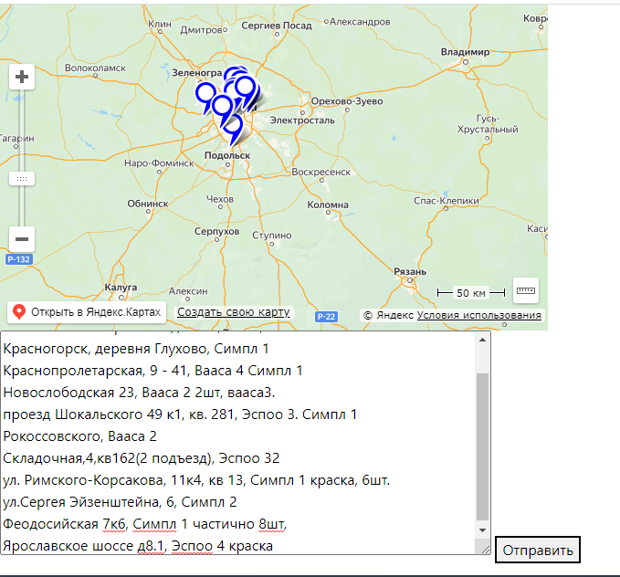

# map

Тестовое задание: тема: Яндекс.Карты
На вход имеется следующий текст:

- Большая Очаковская, вааса 3
- Измайловский проспект дом 47, кв 15, Эспоо 2
- Красногорск, деревня Глухово, Симпл 1
- Краснопролетарская, 9 - 41, Вааса 4 Симпл 1
- Новослободская 23, Вааса 2 2шт, вааса3.
- проезд Шокальского 49 к1, кв. 281, Эспоо 3. Симпл 1
- Рокоссовского, Вааса 2
- Складочная,4,кв162(2 подъезд), Эспоо 32
- ул. Римского-Корсакова, 11к4, кв 13, Симпл 1 краска, 6шт.
- ул.Сергея Эйзенштейна, 6, Симпл 2
- Феодосийская 7к6, Симпл 1 частично 8шт,
- Ярославское шоссе д8.1, Эспоо 4 краска

В каждой строке содержится адрес (это все Москва) и каки-то товары, как-то указанные менеджерами при оформлении заказа.

Необходимо сделать страницу, на которой будет карта яндекса https://yandex.ru/dev/maps/?p=realty , а рядом с ней textarea. При вставке вышеуказанного массива в textarea и после отправки формы на карте должны быть расположены точки по указанным адресам, а в тултипе точки — указаны товары (без дополнительной обработки).
